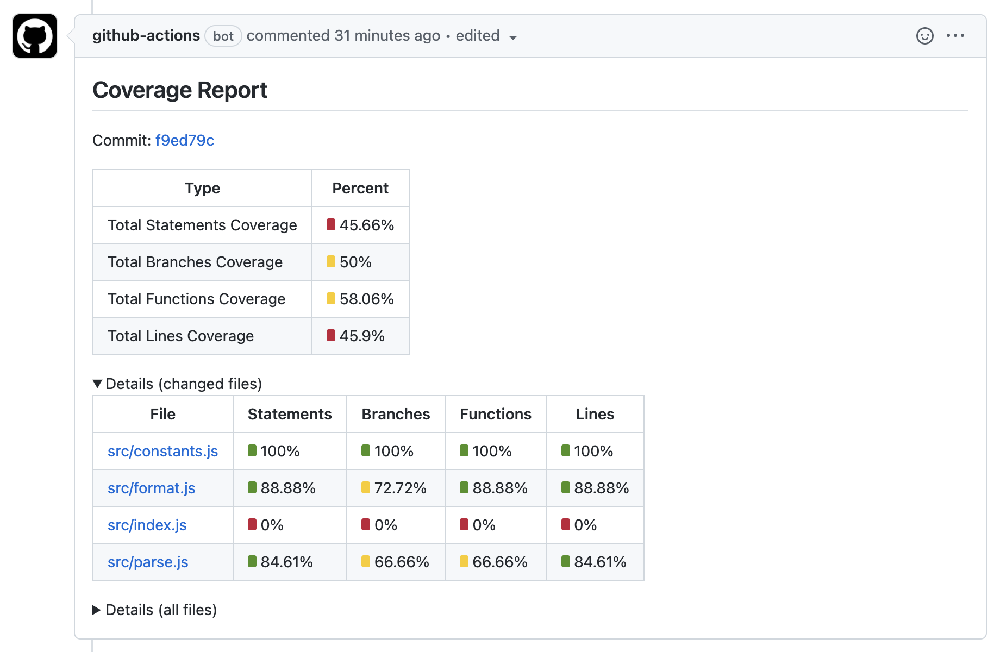

<!-- start title -->

# GitHub Action: Report NYC coverage

<!-- end title -->
<!-- start description -->

GitHub Action that posts the report in a comment on a GitHub Pull Request from coverage data generated by nyc (istanbul).

<!-- end description -->
<!-- start contents -->
<!-- end contents -->

[See sample comment](https://github.com/sidx1024/report-nyc-coverage-github-action/pull/10#issuecomment-1074885726)


## Typical Usage

```yaml
on: [pull_request]

jobs:
  my_app_job:
    runs-on: ubuntu-latest
    name: My App
    steps:
      - name: Checkout
        uses: actions/checkout@v3
        with:
          ref: ${{ github.event.pull_request.head.sha }}

      - name: Run tests
        run: npm run test

      - name: Generate NYC report
        run: |
          npx nyc report \
            --reporter json-summary \
            --report-dir nyc-coverage-report \
            --exclude-after-remap false

      - name: Report NYC coverage
        uses: sidx1024/report-nyc-coverage-github-action@v1.1
        with:
          # Path to coverage output directory generated by "nyc report".
          coverage_output_directory: "nyc-coverage-report"
```

## Usage

<!-- start usage -->

```yaml
- uses: sidx1024/report-nyc-coverage-github-action@v1.0.0
  with:
    # Path to coverage output directory generated by "nyc report".
    coverage_output_directory: ""

    # Template markdown file to be used for GitHub PR comment. Optional.
    # Default: comment-template.md
    comment_template_file: ""

    # "replace" or "new"
    # Default: replace
    comment_mode: ""

    # An alternative GitHub token, other than the default provided by GitHub Actions
    # runner. Optional.
    # Default: ${{ github.token }}
    github_token: ""

    # Absolute path to the source files. The path will be trimmed from the coverage
    # data. Optional. Default is the github workspace directory with a trailing slash.
    # Default: ${{ format('{0}/', github.workspace) }}
    sources_base_path: ""

    # Specify the order for coverage types to be included in the output table. (S:
    # statements, B: branches, F: functions, L: lines). Missing types will be
    # excluded.
    # Default: SBFL
    files_coverage_table_output_type_order: ""

    # This action can internally fetch the required git history to compute the diff of
    # files changed in the pull request. Valid value is "shallow_since". By default,
    # the action will not fetch any git history and assume that a full checkout
    # (fetch-depth: 0) was performed prior to this action usage. The option
    # "shallow_since" is useful when the git repository is huge and a full checkout
    # takes a long time.
    # Default:
    git_fetch_strategy: ""

    # Argument value for "--shallow-since" argument for the git fetch command. Known
    # valid format is YYYY-MM-DD, unix timestamp or a relative time string like "10
    # days", "2 years" etc. Only applicable if git_fetch_strategy is "shallow_since".
    # Default: 30 days
    git_fetch_shallow_since: ""
```

<!-- end usage -->
<!-- start inputs -->

| **Input**                                    | **Description**                                                                                                                                                                                                                                                                                                                                                                                                  |                **Default**                | **Required** |
| :------------------------------------------- | :--------------------------------------------------------------------------------------------------------------------------------------------------------------------------------------------------------------------------------------------------------------------------------------------------------------------------------------------------------------------------------------------------------------- | :---------------------------------------: | :----------: |
| **`coverage_output_directory`**              | Path to coverage output directory generated by "nyc report".                                                                                                                                                                                                                                                                                                                                                     |                                           |   **true**   |
| **`comment_template_file`**                  | Template markdown file to be used for GitHub PR comment. Optional.                                                                                                                                                                                                                                                                                                                                               |           `comment-template.md`           |  **false**   |
| **`comment_mode`**                           | "replace" or "new"                                                                                                                                                                                                                                                                                                                                                                                               |                 `replace`                 |  **false**   |
| **`github_token`**                           | An alternative GitHub token, other than the default provided by GitHub Actions runner. Optional.                                                                                                                                                                                                                                                                                                                 |           `${{ github.token }}`           |  **false**   |
| **`sources_base_path`**                      | Absolute path to the source files. The path will be trimmed from the coverage data. Optional. Default is the github workspace directory with a trailing slash.                                                                                                                                                                                                                                                   | `${{ format('{0}/', github.workspace) }}` |  **false**   |
| **`files_coverage_table_output_type_order`** | Specify the order for coverage types to be included in the output table. (S: statements, B: branches, F: functions, L: lines). Missing types will be excluded.                                                                                                                                                                                                                                                   |                  `SBFL`                   |  **false**   |
| **`git_fetch_strategy`**                     | This action can internally fetch the required git history to compute the diff of files changed in the pull request. Valid value is "shallow_since". By default, the action will not fetch any git history and assume that a full checkout (fetch-depth: 0) was performed prior to this action usage. The option "shallow_since" is useful when the git repository is huge and a full checkout takes a long time. |                                           |  **false**   |
| **`git_fetch_shallow_since`**                | Argument value for "--shallow-since" argument for the git fetch command. Known valid format is YYYY-MM-DD, unix timestamp or a relative time string like "10 days", "2 years" etc. Only applicable if git_fetch_strategy is "shallow_since".                                                                                                                                                                     |                 `30 days`                 |  **false**   |

<!-- end inputs -->
<!-- start outputs -->

| **Output**                              | **Description**                                                                                            | **Default** | **Required** |
| :-------------------------------------- | :--------------------------------------------------------------------------------------------------------- | ----------- | ------------ |
| `total_lines_coverage_percent`          | Total lines coverage percent (XX.XX%) with level indicator                                                 |             |              |
| `total_branches_coverage_percent`       | Total branches coverage percent (XX.XX%) with level indicator                                              |             |              |
| `total_statements_coverage_percent`     | Total statements coverage percent (XX.XX%) with level indicator                                            |             |              |
| `total_functions_coverage_percent`      | Total functions coverage percent (XX.XX%) with level indicator                                             |             |              |
| `total_lines_coverage_percent_raw`      | Total lines coverage percent (XX.XX) without percent and level indicator                                   |             |              |
| `total_branches_coverage_percent_raw`   | Total branches coverage percent (XX.XX) without percent and level indicator                                |             |              |
| `total_statements_coverage_percent_raw` | Total statements coverage percent (XX.XX) without percent and level indicator                              |             |              |
| `total_functions_coverage_percent_raw`  | Total functions coverage percent (XX.XX) without percent and level indicator                               |             |              |
| `files_coverage_table`                  | HTML table content containing the file path and corresponding coverage percent for all files               |             |              |
| `changed_files_coverage_table`          | HTML table content containing the file path and corresponding coverage percent for files changed in the PR |             |              |
| `comment_body`                          | The comment body in HTML format                                                                            |             |              |
| `commit_sha`                            | Last commit SHA (commit due to which this action was executed)                                             |             |              |
| `short_commit_sha`                      | Last commit SHA in shorter format (6ef01b)                                                                 |             |              |
| `commit_link`                           | Relative link for the last commit                                                                          |             |              |

<!-- end outputs -->
<!-- start [.github/ghdocs/examples/] -->
<!-- end [.github/ghdocs/examples/] -->
